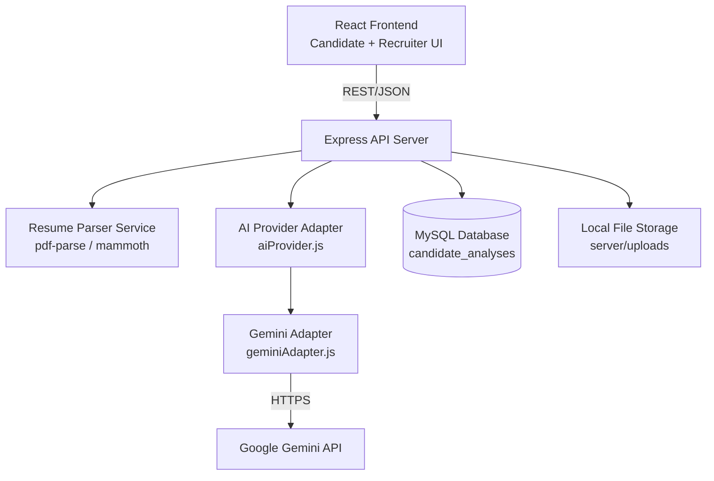
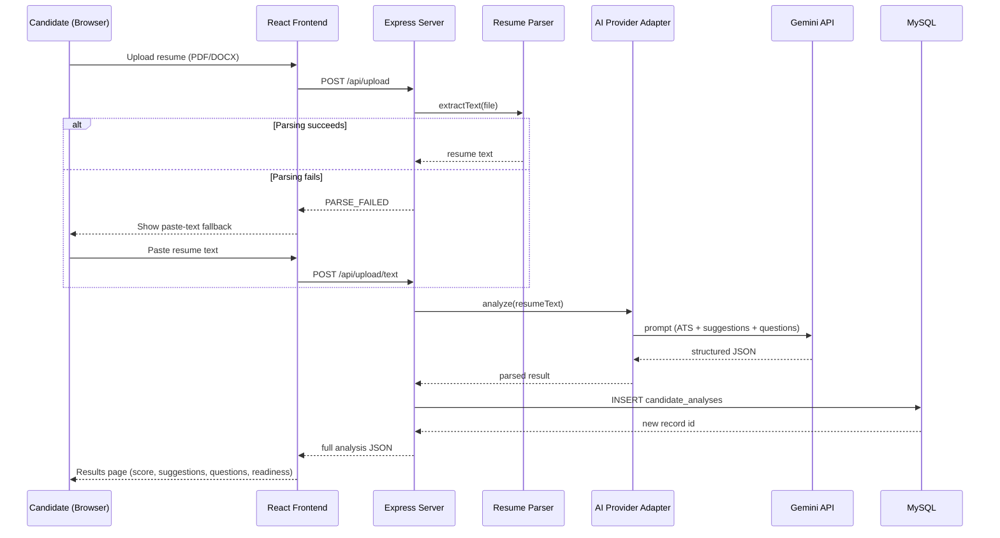

'''
# SmartHire AI — System Architecture (v1.0)

Source of truth: PRD + Implementation Blueprint (Day 1). No redesign — this document adds technical detail only.

## 1. Tech Stack (confirmed, no changes)

| Layer | Choice | Why |
|---|---|---|
| Frontend | React (Vite) | Fast dev server, component-driven UI, matches your existing skills |
| Backend | Node.js + Express | Lightweight REST API, easy file upload handling, matches your skills |
| Database | MySQL | Relational, simple schema, matches your skills, AWS RDS free tier available |
| Auth | None (v1.0) | Explicitly out of scope per PRD — keeps scope lean |
| AI | Google Gemini API via swappable adapter | Free tier, generous limits, adapter pattern allows swapping to Claude/OpenAI later |
| Hosting | AWS EC2 + RDS (Free Tier) | Matches your AWS learning goal, real cloud deployment |
| File Parsing | pdf-parse, mammoth | Free, npm-based, no external API cost |
| Process Manager | pm2 | Keeps Node server alive in production |

No paid tools used anywhere in v1.0.

## 2. Component Diagram

## 3. Data Flow (Candidate Analysis)

## 4. Request Lifecycle (typical API call)

1. Frontend sends request with JSON or multipart/form-data body.
2. Express middleware: CORS check → body parsing / Multer (for file routes) → route handler.
3. Controller validates input (file type/size, required fields).
4. Controller calls the relevant service (parser, AI adapter, or DB layer).
5. Response is shaped into a consistent JSON envelope and returned.
6. Errors are caught by a centralized error handler and returned as `{ error: { code, message } }`.

## 5. AI Interaction Design

- All AI calls go through `aiProvider.js` — the rest of the app never calls Gemini directly.
- `aiProvider.js` exposes: `generateATSAnalysis()`, `generateSuggestions()`, `generateInterviewQuestions()`.
- `geminiAdapter.js` implements these against the Gemini API with strict JSON-only prompts.
- To swap providers later (Claude/OpenAI), only a new adapter file is added — no changes needed to routes, controllers, or the database layer.
- A JSON-safety layer strips markdown fences and retries once on malformed output before failing gracefully.

## 6. External Services

| Service | Purpose | Tier |
|---|---|---|
| Google AI Studio (Gemini API) | Resume/AI analysis | Free tier |
| AWS EC2 | App hosting (frontend + backend) | Free tier (t2.micro/t3.micro) |
| AWS RDS (or EC2-hosted MySQL fallback) | Database | Free tier |
| GitHub | Source control | Free |

## 7. Key Architectural Decisions

- **No authentication in v1.0** — confirmed from PRD; all data is public by design for this version.
- **Single analysis table, no joins** — keeps schema and queries simple, matches PRD data model exactly.
- **Provider-agnostic AI layer** — the single most important architectural decision protecting future flexibility.
- **Graceful degradation** — every external dependency (parser, AI, DB) has a defined failure path so the app never shows a blank/broken screen.

'''