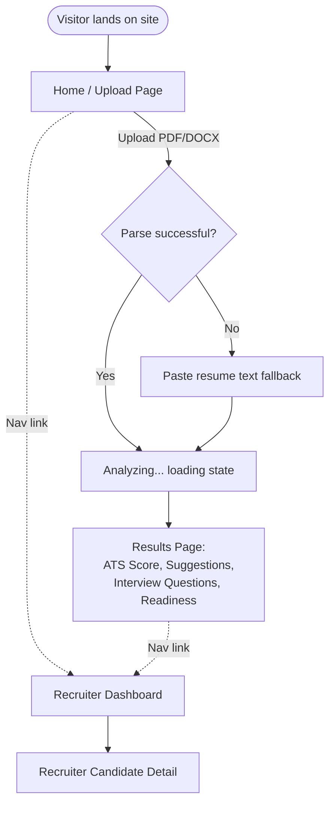

'''

# SmartHire AI — UI & User Flow (v1.0)

## 1. User Flow Diagram

## 2. Screen Flow (Candidate Path — Primary)

1. **Upload Page** (`/`) → user selects/drops a resume file
2. **Fallback Paste Screen** (inline on same page, conditional) → only shown if parsing fails
3. **Loading State** (inline on same page) → "Analyzing your resume..."
4. **Results Page** (`/results/:id`) → full AI report

## 3. Screen Flow (Recruiter Path — Secondary)

1. **Recruiter Dashboard** (`/recruiter`) → list of all analyzed candidates
2. **Recruiter Candidate Detail** (`/recruiter/candidate/:id`) → full AI report (read-only)

## 4. Navigation

Simple top header, no login state to manage:

'''